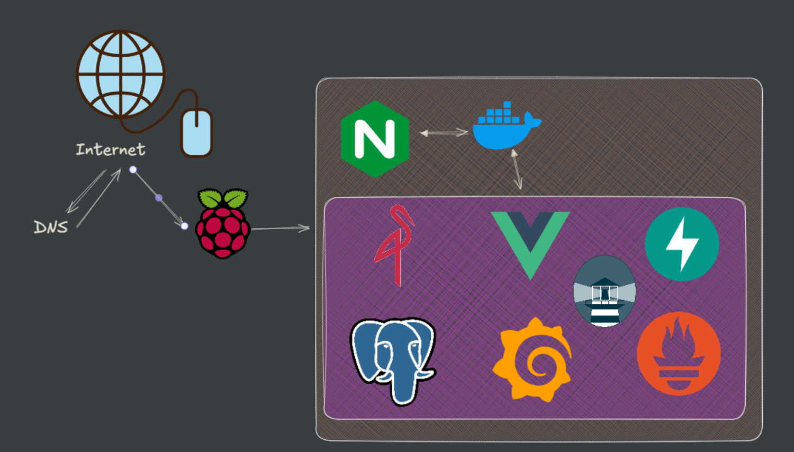

# TrackNTrain Deployment 🚀

Automated deployment infrastructure for TrackNTrain application using Ansible, Docker, and CI/CD pipelines with automatic container updates via Watchtower.



## 📋 Table of Contents

- [Overview](#overview)
- [Architecture](#architecture)
- [Prerequisites](#prerequisites)
- [Project Structure](#project-structure)
- [Deployment Process](#deployment-process)
- [Configuration](#configuration)
- [Monitoring & Updates](#monitoring--updates)
- [Usage](#usage)
- [Security](#security)
- [Contributing](#contributing)

## 🎯 Overview

This repository contains the complete deployment infrastructure for the TrackNTrain application. It provides:

- **Automated Deployment**: Using Ansible playbooks with secure SSH key authentication
- **Container Orchestration**: Docker Compose for multi-service application management
- **Automatic Updates**: Watchtower for continuous container image monitoring and updates
- **SSL/TLS Security**: Automated certificate management with Let's Encrypt
- **Monitoring Stack**: Grafana and Prometheus for application and infrastructure monitoring
- **Reverse Proxy**: Nginx configuration for domain routing and SSL termination

## 🏗️ Architecture

The TrackNTrain deployment consists of the following components:

### Core Services
- **Frontend**: React application (`ghcr.io/track-train/front`)
- **API**: Backend API service (`ghcr.io/track-train/api`)
- **Database**: PostgreSQL for data persistence
- **Storage**: MinIO for object storage and file management

### Infrastructure Services
- **Nginx**: Reverse proxy with SSL termination
- **Watchtower**: Automatic container updates
- **Grafana**: Monitoring dashboards
- **Prometheus**: Metrics collection and monitoring

### Environments
- **Production**: `trackntrain.fr`
- **Pre-production**: `pre-prod.trackntrain.fr`

## 🔧 Prerequisites

Before deploying, ensure you have:

1. **Ansible** installed on your local machine
2. **SSH access** to target servers with secure key authentication
3. **Docker** and **Docker Compose** on target servers
4. **Domain names** configured and pointing to your servers
5. **GitHub Container Registry** access for pulling images

## 📁 Project Structure

```
.
├── ansible/
│   ├── ansible.cfg                    # Ansible configuration
│   ├── hosts                         # Inventory file with server definitions
│   ├── playbooks/
│   │   └── site.yml                  # Main deployment playbook
│   ├── roles/
│   │   ├── deploy/                   # Application deployment role
│   │   │   └── templates/
│   │   │       ├── docker-compose.j2 # Docker Compose template
│   │   │       ├── env.j2            # Environment variables template
│   │   │       └── prometheus.yml.j2  # Prometheus configuration
│   │   ├── nginx/                    # Nginx configuration role
│   │   │   ├── tasks/main.yml        # Nginx installation and setup
│   │   │   └── templates/nginx.conf.j2 # Nginx configuration template
│   │   ├── docker/                   # Docker installation role
│   │   └── certbot/                  # SSL certificate management role
│   └── host_vars/
│       ├── trackntrain.fr.yml        # Production variables
│       └── pre-prod.trackntrain.fr.yml # Pre-production variables (encrypted)
├── docker-compose.yml                # Local development compose file
└── README.md                        # This file
```

## 🚀 Deployment Process

### 1. SSH Key Configuration

The deployment uses secure SSH key authentication:

```bash
# SSH configuration in ansible/hosts
ansible_ssh_private_key_file = ../../../key/id_runner
ansible_connection = ssh
ansible_user = user
```

### 2. Ansible Roles Execution

The deployment process executes the following roles in sequence:

```yaml
roles:
  - { role: docker,    tags: docker }    # Install and configure Docker
  - { role: certbot,   tags: certbot }   # Setup SSL certificates
  - { role: nginx,     tags: nginx }     # Configure reverse proxy
  - { role: deploy,    tags: deploy }    # Deploy application stack
```

### 3. Environment-Specific Variables

Each environment has its own configuration:

**Production** (`trackntrain.fr`):
- API: `ghcr.io/track-train/api:prod`
- Frontend: `ghcr.io/track-train/front:prod`
- External ports: API (8000), Frontend (3000), Database (5432)

**Pre-production** (`pre-prod.trackntrain.fr`):
- Encrypted configuration using Ansible Vault
- Separate container volumes and configurations

### 4. Run Deployment

```bash
cd ansible
ansible-playbook playbooks/site.yml
```

Or deploy specific components:

```bash
# Deploy only Docker role
ansible-playbook playbooks/site.yml --tags docker

# Deploy only application
ansible-playbook playbooks/site.yml --tags deploy

# Deploy to specific environment
ansible-playbook playbooks/site.yml --limit prod
```

## ⚙️ Configuration

### Docker Compose Services

The application stack includes:

```yaml
services:
  postgres:      # Database service
  minio:         # Object storage
  api:           # Backend API
  front:         # Frontend application
  watchtower:    # Auto-updater
  grafana:       # Monitoring dashboard
  prometheus:    # Metrics collection
```

### Environment Variables

Key configuration variables managed through Ansible templates:

- **Database**: `POSTGRES_USER`, `POSTGRES_PASSWORD`, `POSTGRES_DB`
- **API**: `SECRET_KEY`, `DATABASE_URL`, `ACCESS_TOKEN_EXPIRE_MINUTES`
- **MinIO**: `MINIO_ROOT_USER`, `MINIO_ROOT_PASSWORD`, `MINIO_ENDPOINT`
- **Frontend**: `VITE_APP_API_URL`
- **Monitoring**: `GF_SECURITY_ADMIN_USER`, `GF_SECURITY_ADMIN_PASSWORD`

### SSL/TLS Configuration

Nginx is configured with:
- Automatic HTTP to HTTPS redirection
- Let's Encrypt certificates
- SSL/TLS best practices
- Domain-specific routing for all services

## 🔄 Monitoring & Updates

### Watchtower Auto-Updates

Watchtower continuously monitors and updates containers:

```yaml
watchtower:
  image: containrrr/watchtower:latest
  command:
    - --interval
    - "${WATCHTOWER_INTERVAL:-300}"  # Check every 5 minutes
    - --label-enable                 # Only update labeled containers
    - --cleanup                      # Remove old images
```

**Monitored Services**:
- API container: `ghcr.io/track-train/api`
- Frontend container: `ghcr.io/track-train/front`

### Monitoring Stack

**Grafana** (Port 4000):
- Web interface for monitoring dashboards
- Admin access: `admin/admin` (configurable)
- Available at: `https://pre-prod-grafana.trackntrain.fr`

**Prometheus** (Port 9090):
- Metrics collection and storage
- Configurable scrape intervals
- Custom job definitions supported

## 🎮 Usage

### Accessing Services

- **Frontend**: `https://trackntrain.fr` or `https://pre-prod.trackntrain.fr`
- **API**: `https://api.trackntrain.fr`
- **MinIO Console**: `https://minio.trackntrain.fr/console/`
- **Grafana**: `https://grafana.trackntrain.fr`

### Managing the Deployment

```bash
# Check service status
docker ps

# View logs
docker logs trackntrain_backend
docker logs trackntrain_frontend
docker logs trackntrain_watchtower

# Restart services
docker-compose restart api
docker-compose restart frontend

# Update specific service manually
docker-compose pull api && docker-compose up -d api
```

### Environment Management

```bash
# Deploy to production
ansible-playbook playbooks/site.yml --limit prod

# Deploy to pre-production
ansible-playbook playbooks/site.yml --limit pre_prod

# Check configuration
ansible-playbook playbooks/site.yml --check
```

## 🔒 Security

### SSH Security
- Private key authentication (`id_runner`)
- No password authentication
- Secure key storage outside repository

### SSL/TLS
- Let's Encrypt certificates
- Automatic certificate renewal
- HTTPS-only access with HTTP redirection
- SSL/TLS best practices configuration

### Container Security
- Regular image updates via Watchtower
- Non-root user execution where possible
- Network isolation between services
- Secure environment variable management

### Secrets Management
- Ansible Vault for sensitive data
- Environment-specific encrypted variables
- No hardcoded credentials in templates

## 🤝 Contributing

1. Fork the repository
2. Create a feature branch: `git checkout -b feature/new-feature`
3. Make your changes
4. Test deployment on pre-production environment
5. Commit changes: `git commit -am 'Add new feature'`
6. Push to branch: `git push origin feature/new-feature`
7. Submit a Pull Request

### Development Workflow

1. **Local Testing**: Use `docker-compose.yml` for local development
2. **Pre-production**: Deploy to `pre-prod.trackntrain.fr` for testing
3. **Production**: Deploy to `trackntrain.fr` after validation

---

**TrackNTrain Deployment** - Automated, secure, and monitored container deployment for modern web applications.